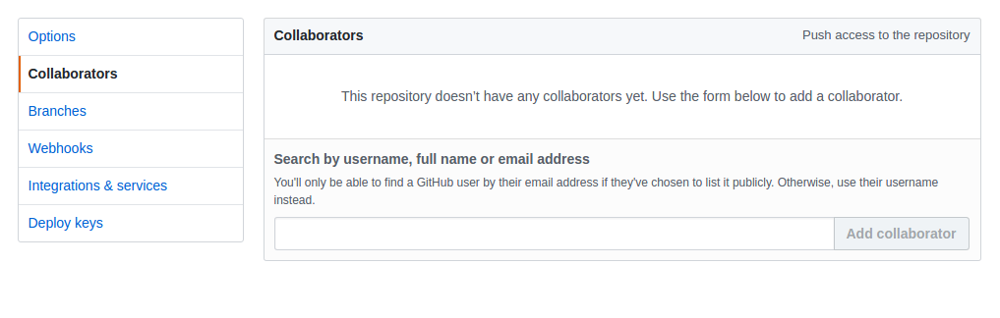

# How to create pull request

1. Add me to coloborators of repository where you solivng exercises.

2. Solve exercises that present in this repository.
3. Create pull request
4. Add me as reviewer to this pull request.
5. Wait for my comments to your code :)
